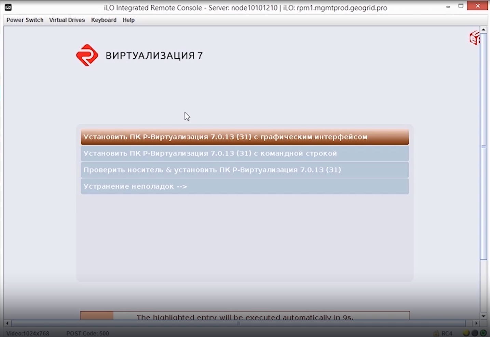
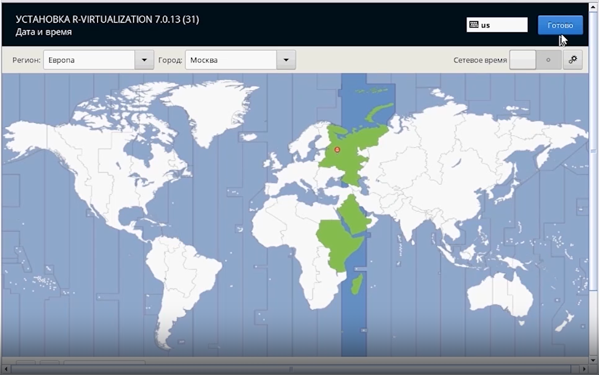

#__3.Пошаговая инструкция:__
!!! примечание 
    расшифровка видео
<figure markdown="span">
  { width="900" }
  <figcaption>Скриншот 1.</figcaption>
</figure> 
При запуске установщика появится меню как скриншоте 1, где необходимо выбрать первый пункт или если не выбирать, то через несколько секунд система автоматический выберет его.
<figure markdown="span">
  { width="900" }
  <figcaption>Скриншот 2.</figcaption>
</figure> 
Следующим шагом необходимо выбрать время региона. 
<figure markdown="span">
  { width="900" }
  <figcaption>Скриншот 3.</figcaption>
</figure>
Чтобы продолжить необходимо выбрать принять пользовательское соглашение.
<figure markdown="span">
  { width="900" }
  <figcaption>Скриншот 4.</figcaption>
</figure>
В разделе дисков как на скриншоте 4 выбирается расположение, куда будет непосредственно устанавливаться система. В данном примере на сервере имеется только один **SSD**, и в этом случае его можно использовать под роль КЭШ на шаге настройки Р-хранилища через веб панель, а систему установить на один из **HDD**.
<figure markdown="span">
  { width="900" }
  <figcaption>Скриншот 5.</figcaption>
</figure>
Следующий шаг необходимо выполнить настройку в разделе сети как на скриншоте 5. Это будет первая нода в кластере — первая установка на первый сервер. Укажем имя хоста. Далее проведем первичную настройку и подготовку имеющихся интерфейсов. На всех интерфейсах необходимо выключить **IPv6**, а также **IPv4**.
<figure markdown="span">
  { width="900" }
  <figcaption>Скриншот 6.</figcaption>
</figure>
<figure markdown="span">
  { width="900" }
  <figcaption>Скриншот 7.</figcaption>
</figure>
???+ success "Важно!"
    После проведения первичной настройки интерфейсов обратите внимание на то, что все интерфейсы, которые вы планируете использовать в сети управления и в сети хранилища, находятся в статусе "подключен" как на скриншоте 7.
После того как первичная настройка интерфейсов завершена, можно перейти к следующему этапу. Согласно рекомендациям, для обеспечения отказоустойчивости требуется агрегация портов. 

Для работы виртуализации требуется создание такого интерфейса, как мост, и при этом с агрегированными портами. Они будут находиться в отдельном **VLAN**, который предназначается для сети управления. Сборка такой связки начинается с создания моста. 
???+ success "Важно!"
    Самый распространённый сценарий использования сети — это когда сеть панели Р-управления в отдельном **VLAN**. **VLAN** для других сетей можно уже будет сделать после установки и настройки Р-управления. 
Выберите тип устройства — выберем **Bridge**. В названии соединения можно указывать не более 16 символов. В нашем примере название соединения будет следующим образом: **br-mb0.120**. Такое название оптимально с точки зрения удобства администрирования, когда вы собираете связку и в дальнейшем при создании других сетей через панель, она их будет создавать с именами аналогичным образом. 

В имени тип создаваемого интерфейса — мост (**Bridge**), дальше идет **mb0**, где **b** означает **Bond** (агрегированные порты), 0 — это его порядковый номер, нумерация начинается с нуля, то есть это первый бонд, первая группа с агрегированных портов, m говорит о том, что этот бонд обеспечивает сеть управления (Management **Bond**). 

Через точку указывается **VLAN**, в котором будет присутствовать данный агрегированный порт.
???+ success "Важно!"
    Мы рекомендуем называть таким образом с точки зрения синтаксиса, потому что впоследствии, если вам необходимо будет создать дополнительную виртуальную сеть, то система будет создавать сеть с названием, которое будет иметь аналогичный вид, и в процессе дальнейшей работы и администрирования будет легче ориентироваться среди всех интерфейсов.
Далее в графе "интерфейс" следует продублировать название соединения, укажем **br-mb0.120** как на скриншоте 8.
<figure markdown="span">
  { width="900" }
  <figcaption>Скриншот 8.</figcaption>
</figure>
Следующим шагом необходимо задать IP-адрес ноды на скриншоте 10. Параметры **IPv6** мы рекомендуем всегда отключать, поэтому укажем в графе метод "игнорировать". Параметры **IPv4** назначаем вручную как показано на скриншоте 9.
<figure markdown="span">
  { width="900" }
  <figcaption>Скриншот 9.</figcaption>
</figure>
<figure markdown="span">
  { width="900" }
  <figcaption>Скриншот 10.</figcaption>
</figure>
<figure markdown="span">
  { width="900" }
  <figcaption>Скриншот 11.</figcaption>
</figure>
Далее необходимо создать **VLAN** в разделе мост, в котором будет находиться **bond**. Название соединения указывается такое же, каким оно было на этапе создания моста, но только без предшествующего префикса **br**. Подобные названия в дальнейшем будут необходимы при администрировании имеющихся виртуальных сетей. Тег **VLAN** – 120 на скриншоте, у вас будет свой номер в зависимости от настроек вашей сети (физического коммутатора). Имя интерфейса **VLAN** – тут следует продублировать название соединения. 
<figure markdown="span">
  { width="900" }
  <figcaption>Скриншот 12.</figcaption>
</figure>
Следующим шагом необходимо добавить **Bond**. В поле “Родительский интерфейс” - в выпадающем меню можно выбрать графу создать соединение. Тип соединения - **Bond**. Название соединения выставляем **mb0**, интерфейс продублируем mb0, режим поставим **LACP** он же **802.3ad**, и теперь добавим интерфейсы, которые будут в качестве **slave**.
<figure markdown="span">
  { width="900" }
  <figcaption>Скриншот 13.</figcaption>
</figure> 
В названии соединения для последующего администрирования прописываются такие же названия интерфейсов, какие назначила система.
<figure markdown="span">
  { width="900" }
  <figcaption>Скриншот 14.</figcaption>
</figure> 
После того как собрана вся связка необходимо по порядку во всех открытых окнах нажать кнопку "сохранить": **Bond**, **VLAN** и мост. 

Следующим шагом перейти в настройки **Bond**. В параметре **IPv6** и обязательно не забудьте это сделать, установите опцию "игнорировать". Далее перейдите в параметры **IPv4** и выключите. Это необходимо сделать, для исключения **flapping**-а сетевых интерфейсов.
<figure markdown="span">
  { width="900" }
  <figcaption>Скриншот 15.</figcaption>
</figure> 
Когда **Bond** включен, он отобразит зависимые интерфейсы как на скриншоте 15. Как минимум должно быть два зависимых интерфейса. 
<figure markdown="span">
  { width="900" }
  <figcaption>Скриншот 16.</figcaption>
</figure>
Также должен быть виден в списке **VLAN**, который создавался, и которого родительский интерфейс **Bond**, и мост с сетевыми настройками, которые принадлежат ноде.
<figure markdown="span">
  { width="900" }
  <figcaption>Скриншот 17.</figcaption>
</figure>
Если у вас получилось так как на предыдущих скриншотах и на скриншоте 17, то далее переходим к настройке сети хранилища. Для работы сети хранилища не требуется мост, а также не используется **VLAN**, поэтому переходим сразу к созданию **Bond**'а. Первым делом перейдем во вкладку «основное» и установим галочку, чтобы не создался мост автоматически как на скриншоте 18.
<figure markdown="span">
  { width="900" }
  <figcaption>Скриншот 18.</figcaption>
</figure>
Название соединения прописываем **sb1**, потому что это уже второй Bond по нумерации, поэтому будет цифра один — Storage **Bond** 1 (**sb1**). Интерфейс - продублируем название **sb1**. Параметры **IPv6** мы рекомендуем отключать, выставляя значение игнорировать. Поставим в графе параметры **IPv4** "вручную", следует указать тот **IP**-адрес, который предполагается для сети хранилища на этой ноды. 

Прописывается только **IP**-адрес и маска сети. В настройках сети хранилища не должно быть ни шлюза, ни **DNS**. Режим выставляем на **LACP** (**802.3ad**) как на скриншоте 20 и добавим **slave** интерфейсы для агрегации как на скриншоте 19. В текущем случае это будут два интерфейса по 10 Гигабит. Назовём соединение **slave** интерфейсы также, как их называла система. 
???+ success "Важно!"
    После того как настройки сети для хранилища завершены можно проверить c других устройств (если есть такая возможность) из этой же сети с помощью **ping** доступность настроенного адреса ноды. Для сети управления также можно выполнить эту же проверку только со стороны устройств, имеющих адресацию из этой же сети. 

    В случае отсутствия **ping** необходимо перепроверить правильность выполнения проверки, а далее перепроверить все настройки, выполненные выше. Если все в порядке, **ping** должен быть непрерывным в противном случае необходимо проверять настройки коммутационного оборудования или аппаратные проблемы.
<figure markdown="span">
  { width="900" }
  <figcaption>Скриншот 19.</figcaption>
</figure> 
<figure markdown="span">
  { width="900" }
  <figcaption>Скриншот 20.</figcaption>
</figure>
Следующий шаг — это настройка панели управления. Это делается при установке только первой ноды, следует отметить пункт “управления и виртуализации” как на скриншоте 21, чтобы была установлена панель управления, и необходимо назначить **IP**-адрес панели управления. Должен быть **IP**-адрес, который заведомо выделен и свободен для веб-интерфейса Р-управления, и он обязательно из этой же сети, которая предусмотрена для сети управления. На этапе установки имя хоста панели управления можно прописать любое или ассоциированное с тем, что это будет относится к панели управления виртуализацией, которая может находится на любых хостах-участниках кластера.
<figure markdown="span">
  { width="900" }
  <figcaption>Скриншот 21.</figcaption>
</figure>
Далее настройка панели **Р-Хранилище** также при первой установке на первую ноду. Надо выбрать самый первый пункт панель управления и **Р-хранилище** для установки панели управления скриншот 22. 

**IP**-адрес панели управления **Р-хранилища** также должен быть в сети управления, и также надо указать заведомо свободный для веб-интерфейса **IP**-адрес. Имя хоста панели управления хранилищем можно ассоциировать с тем, что это будет панель для визуального управления, так как сам кластер Р-хранилища может работать и управляться без панели после завершения всех настроек.
<figure markdown="span">
  { width="900" }
  <figcaption>Скриншот 22.</figcaption>
</figure>
<figure markdown="span">
  { width="900" }
  <figcaption>Скриншот 23.</figcaption>
</figure>
На этом этапе первичные настройки завершены, можно перейти непосредственно к установке Росплатформы на сервер, где в следующем открывшемся меню можно перейти в **ready kernel**  и можно выключить функцию автоматическое обновления ядра, далее зададим пароль для пользователя **root**. Создание дополнительных пользователей на этом этапе не требуется, это можно сделать после.

Перейдем во вкладку "лицензионный ключ", оставим поле пустым, потому что лицензионный ключ будет вводиться позже после установки, нажмем "готово" и дождемся завершения установки.
<figure markdown="span">
  { width="900" }
  <figcaption>Скриншот 24.</figcaption>
</figure>
После перезагрузки ноды, можно на нее зайти, используя логин **root** и пароль по **SSH**, который указывался при установке ноды. Также проверим доступность веб-интерфейса Р-управления и проверим доступность контейнера управления Р-хранилища по тем **IP**-адресам, которые назначали при установке.
<figure markdown="span">
  { width="900" }
  <figcaption>Скриншот 25.</figcaption>
</figure>
Откроем в браузере веб-панель управления, пропишем **IP**-адрес, который задавался на этапе установки Росплатформы. Будем использовать учетную запись с паролем, который также был задан на этапе установки.
<figure markdown="span">
  { width="900" }
  <figcaption>Скриншот 26.</figcaption>
</figure>
Проверим также веб-интерфейс **Р-хранилище**. Используя учетную запись root и пароль, заданный при установке, можно войти в интерфейс **Р-хранилища**.

После завершения проверки можно переходить к установке Росплатформы на остальные сервера. Установка Росплатформы на оставшиеся сервера выполняется аналогичным способом за исключением одного: во вкладке **Р-управление** необходимо выбрать второй из двух пунктов "Виртуализация - регистрация в существующих панелях управления".
<figure markdown="span">
  { width="900" }
  <figcaption>Скриншот 27.</figcaption>
</figure>
???+ success "Важно!"
    Здесь сразу можно выполнить регистрацию, однако рекомендуется выполнять регистрацию вручную после установки для исключения путаницы в сетевой инфраструктуре, поэтому оставим эти графы пустыми.
<figure markdown="span">
  { width="900" }
  <figcaption>Скриншот 28.</figcaption>
</figure>  
Теперь перейдем во вкладку **Р-хранилище**, выберем второй из трех имеющихся вариантов "Хранилище данных - регистрация существующих панелях управления" и также оставим имеющиеся поля ниже пустыми, нажмем "готово", нажмем "далее", и можно начинать установку.
???+ success "Важно!"
    Здесь не описывается процесс настройки сетевых интерфейсов, выбор системного диска и времени, потому что эти настройки выполняются аналогично описанию при установки первой ноды. 
<figure markdown="span">
  { width="900" }
  <figcaption>Скриншот 29.</figcaption>
</figure>
После того как установка Росплатформы выполнена на всех узлах, можно перейти в панель **Р-хранилища**. Для этого введем в адресной строке браузера ее **IP**-адрес, который указывали на этапе установки. Для входа используется учетная запись root и пароль, который задавался на этапе установки.   

Тут пока видим одну единственную ноду, как раз ту, на которой находится контейнер управления и хранилища. Первым делом надо настроить сетевые роли ноды. Зайдем в ноду, далее в настройки её сетевых интерфейсов - **Network**. Выберем сеть Р-управления и назначим роли для сети Р-управления.

Следует выбрать роли управления Панель управления и **SSH**, лишнее уберем. Применим и перейдем к настройке ролей для сети **Р-хранилища**. Для сети **Р-хранилища** оставим **SSH** и добавим роль непосредственно хранилища “**Storage**”, применим заданные параметры.
<figure markdown="span">
  { width="900" }
  <figcaption>Скриншот 30.</figcaption>
</figure>
Далее после завершения настройки сетевых ролей можно создать кластер. Перейдем для этого еще раз в ноду, и здесь выберем пункт "создать кластер". Язык интерфейса можно сменить на русский.
<figure markdown="span">
  { width="900" }
  <figcaption>Скриншот 31.</figcaption>
</figure>
В первой графе можно задать название вашего кластера, в нашем случае **c01**. Сразу автоматически подхватывается сеть **Р-хранилища**, если предварительно правильно настроили сетевые роли, и далее перейдем в дополнительные настройки.

В расширенных настройках “**advanced configuration**” можно изменить роли дисков, которые были им присвоены системой по умолчанию.

Дело в том, что можно по-разному организовывать дисковое пространство, объединяя их в разные уровни, которые могут использоваться для хранения разных типов данных, а также для разграничения более производительных дисков от более медленных. 

В нашей конфигурации будет использоваться один **SSD**-диск для хранения на нем кэша или, другими словами, согласно нашей архитектуре журналы записи для жестких дисков. 
???+ success "Важно!"
    Это рекомендуется для обеспечения более высокой производительности. Как правило, один **SSD**-диск может обеспечить хранение кэша(журналы записи) для 3-4 жестких дисков. Однако это зависит от технических характеристик дисков, и этого **SSD**-диска хватит только на два жестких диска. Чтобы это работало необходимо еще объединить в один уровень. Оставшиеся жесткие диски в другой медленный уровень, так как кэш этих жестких дисков будет храниться на них же, и производительность этого уровня будет несколько ниже.
<figure markdown="span">
  { width="900" }
  <figcaption>Скриншот 32.</figcaption>
</figure>
Роли изменены в соответствии с вышесказанной рекомендацией, создадим кластер с новыми параметрами. 

После создания кластера увидим, что в левой части **web**-интерфейса Р-хранилище появились дополнительные пункты с дополнительными настройками.
<figure markdown="span">
  { width="900" }
  <figcaption>Скриншот 33.</figcaption>
</figure>
Теперь необходимо проверить, правильно ли применились роли на дисках. Перейдем в ноду, откроем диски и убедимся, что все корректно, все так, как и задавалось на этапе создания кластера. 

После создания кластера надо зарегистрировать остальные ноды в панели **Р-Хранилища**. Для регистрации остальных нод в панели управления R-хранилища надо зайти на них по **SSH**, используя их **IP**-адрес сети **Р-управления**, который задавался на этапе установки, и выполнить определенную команду, показанную под скриншотом 34. 
???+ success "Важно!"
    Регистрация с помощью командной строки используется, чтобы исключить возможную путаницу в сети при развертывании кластера под продуктивную среду. В более простых кластерах без агрегации для ознакомления софтом можно указывать **IP**-адрес панели управления сразу в инсталляторе, чтобы при установке узлов они сразу регистрировались в панели управления **Р-хранилища**.
<figure markdown="span">
  { width="900" }
  <figcaption>Скриншот 34.</figcaption>
</figure>
Команда, которую надо выполнить: 
``` yaml 
#/usr/libexec/vstorage-ui-agent/bin/register-storage-node.sh -m 192.168.12.8 -t 5b451b92
```
после ключа **-m** надо указать **IP**-адрес панели управления Р-хранилище. В нашем случае это **192.168.12.8**, тот самый адрес, который с портом **8888**, и после ключа **-t** надо указать токен. 

Токен как на скриншоте 34 можно получить непосредственно в панели управления, нажав кнопку "добавить ноду" или "**add node**" смотря какая языковая раскладка, его копируем, вставляем в команду и выполняем ее. Пример выполнения на скриншоте 35-36.
<figure markdown="span">
  { width="900" }
  <figcaption>Скриншот 35.</figcaption>
</figure>
После выполнения команды нода появится в панели управления **Р-хранилище**, но сначала на ней отображается символ троеточия, надо дождаться, пока этот символ сменится на вопросительный знак, для ускорения этого процесса можно обновить страницу.
<figure markdown="span">
  { width="900" }
  <figcaption>Скриншот 36.</figcaption>
</figure>
Добавим третью ноду по такому же принципу. Скопируем уже готовую команду, которую вводили на предыдущей ноде. 
<figure markdown="span">
  { width="900" }
  <figcaption>Скриншот 37.</figcaption>
</figure>
Следующий наш шаг — это настройка сетевых ролей нод, которую надо выполнить также, как и на первой ноде.
<figure markdown="span">
  { width="900" }
  <figcaption>Скриншот 38.</figcaption>
</figure> 
После завершения настройки сетевых ролей новых нод добавим их в кластер, настроив дисковые роли аналогично первой ноде. Для этого перейдем в ноду и нажмём «**Join Cluster**».


Автоматически подхватится нужный интерфейс, который используется для сети хранилища, перейдем в дополнительные настройки, зададим их так же, как и на первой ноде, и дождемся присоединения второй ноды к нашему кластеру. Обновим страницу при необходимости. 


После добавления второй ноты в кластер проверим дисковые роли. Теперь можно добавить третью ноду в кластер аналогичным способом.
<figure markdown="span">
  { width="900" }
  <figcaption>Скриншот 39.</figcaption>
</figure> 


