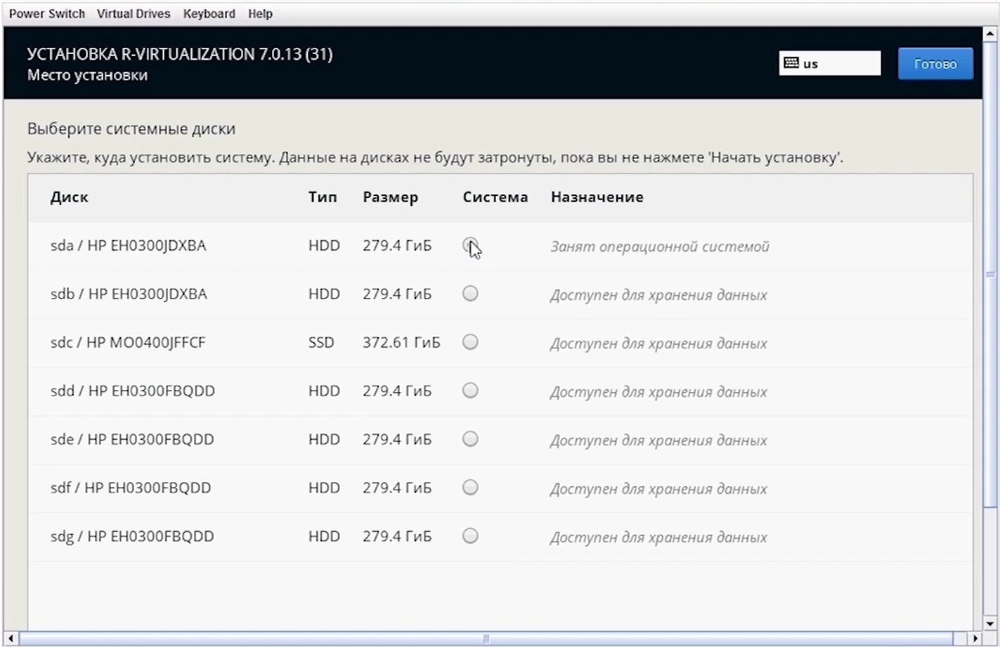

#__Пошаговая инструкция:__
!!! примечание 
    расшифровка видео
---
**загрузка установщика**
---
<figure markdown="span">
  { width="900" }
  <figcaption>Скриншот 1.</figcaption>
</figure> 
При запуске установщика появится меню как скриншоте 1, где необходимо выбрать первый пункт или если не выбирать, то через несколько секунд система автоматический выберет его.
<figure markdown="span">
  { width="900" }
  <figcaption>Скриншот 2.</figcaption>
</figure> 
Следующим шагом необходимо выбрать время региона. 
<figure markdown="span">
  { width="900" }
  <figcaption>Скриншот 3.</figcaption>
</figure>
Чтобы продолжить необходимо выбрать принять пользовательское соглашение.
<figure markdown="span">
  { width="900" }
  <figcaption>Скриншот 4.</figcaption>
</figure>
В разделе дисков как на скриншоте 4 выбирается расположение, куда будет непосредственно устанавливаться система. В данном примере на сервере имеется только один **SSD**, и в этом случае его можно использовать под роль КЭШ на шаге настройки Р-хранилища через веб панель, а систему установить на один из **HDD**.
<figure markdown="span">
  { width="900" }
  <figcaption>Скриншот 5.</figcaption>
</figure>
Следующий шаг необходимо выполнить настройку в разделе сети как на скриншоте 5. Это будет первая нода в кластере — первая установка на первый сервер. Укажем имя хоста. Далее проведем первичную настройку и подготовку имеющихся интерфейсов. На всех интерфейсах необходимо выключить **IPv6**, а также **IPv4**.
<figure markdown="span">
  { width="900" }
  <figcaption>Скриншот 6.</figcaption>
</figure>
<figure markdown="span">
  { width="900" }
  <figcaption>Скриншот 7.</figcaption>
</figure>
???+ success "Важно!"
    После проведения первичной настройки интерфейсов обратите внимание на то, что все интерфейсы, которые вы планируете использовать в сети управления и в сети хранилища, находятся в статусе "подключен" как на скриншоте 7.
После того как первичная настройка интерфейсов завершена, можно перейти к следующему этапу. Согласно рекомендациям, для обеспечения отказоустойчивости требуется агрегация портов. 

Для работы виртуализации требуется создание такого интерфейса, как мост, и при этом с агрегированными портами. Они будут находиться в отдельном **VLAN**, который предназначается для сети управления. Сборка такой связки начинается с создания моста. 
???+ success "Важно!"
    Самый распространённый сценарий использования сети — это когда сеть панели Р-управления в отдельном **VLAN**. **VLAN** для других сетей можно уже будет сделать после установки и настройки Р-управления. 
Выберите тип устройства — выберем **Bridge**. В названии соединения можно указывать не более 16 символов. В нашем примере название соединения будет следующим образом: **br-mb0.120**. Такое название оптимально с точки зрения удобства администрирования, когда вы собираете связку и в дальнейшем при создании других сетей через панель, она их будет создавать с именами аналогичным образом. 

В имени тип создаваемого интерфейса — мост (**Bridge**), дальше идет **mb0**, где **b** означает **Bond** (агрегированные порты), 0 — это его порядковый номер, нумерация начинается с нуля, то есть это первый бонд, первая группа с агрегированных портов, m говорит о том, что этот бонд обеспечивает сеть управления (Management **Bond**). 

Через точку указывается **VLAN**, в котором будет присутствовать данный агрегированный порт.
???+ success "Важно!"
    Мы рекомендуем называть таким образом с точки зрения синтаксиса, потому что впоследствии, если вам необходимо будет создать дополнительную виртуальную сеть, то система будет создавать сеть с названием, которое будет иметь аналогичный вид, и в процессе дальнейшей работы и администрирования будет легче ориентироваться среди всех интерфейсов.
Далее в графе "интерфейс" следует продублировать название соединения, укажем **br-mb0.120** как на скриншоте 8.
<figure markdown="span">
  { width="900" }
  <figcaption>Скриншот 8.</figcaption>
</figure>
Следующим шагом необходимо задать IP-адрес ноды на скриншоте 10. Параметры **IPv6** мы рекомендуем всегда отключать, поэтому укажем в графе метод "игнорировать". Параметры **IPv4** назначаем вручную как показано на скриншоте 9.
<figure markdown="span">
  { width="900" }
  <figcaption>Скриншот 9.</figcaption>
</figure>
<figure markdown="span">
  { width="900" }
  <figcaption>Скриншот 10.</figcaption>
</figure>
<figure markdown="span">
  { width="900" }
  <figcaption>Скриншот 11.</figcaption>
</figure>
Далее необходимо создать **VLAN** в разделе мост, в котором будет находиться **bond**. Название соединения указывается такое же, каким оно было на этапе создания моста, но только без предшествующего префикса **br**. Подобные названия в дальнейшем будут необходимы при администрировании имеющихся виртуальных сетей. Тег **VLAN** – 120 на скриншоте, у вас будет свой номер в зависимости от настроек вашей сети (физического коммутатора). Имя интерфейса **VLAN** – тут следует продублировать название соединения. 
<figure markdown="span">
  { width="900" }
  <figcaption>Скриншот 12.</figcaption>
</figure>
Следующим шагом необходимо добавить **Bond**. В поле “Родительский интерфейс” - в выпадающем меню можно выбрать графу создать соединение. Тип соединения - **Bond**. Название соединения выставляем **mb0**, интерфейс продублируем mb0, режим поставим **LACP** он же **802.3ad**, и теперь добавим интерфейсы, которые будут в качестве **slave**.
<figure markdown="span">
  { width="900" }
  <figcaption>Скриншот 13.</figcaption>
</figure> 
В названии соединения для последующего администрирования прописываются такие же названия интерфейсов, какие назначила система.
<figure markdown="span">
  { width="900" }
  <figcaption>Скриншот 14.</figcaption>
</figure> 
После того как собрана вся связка необходимо по порядку во всех открытых окнах нажать кнопку "сохранить": **Bond**, **VLAN** и мост. 

Следующим шагом перейти в настройки **Bond**. В параметре **IPv6** и обязательно не забудьте это сделать, установите опцию "игнорировать". Далее перейдите в параметры **IPv4** и выключите. Это необходимо сделать, для исключения **flapping**-а сетевых интерфейсов.
<figure markdown="span">
  { width="900" }
  <figcaption>Скриншот 15.</figcaption>
</figure> 
Когда **Bond** включен, он отобразит зависимые интерфейсы как на скриншоте 15. Как минимум должно быть два зависимых интерфейса. 
<figure markdown="span">
  { width="900" }
  <figcaption>Скриншот 16.</figcaption>
</figure>
Также должен быть виден в списке **VLAN**, который создавался, и которого родительский интерфейс **Bond**, и мост с сетевыми настройками, которые принадлежат ноде.
<figure markdown="span">
  { width="900" }
  <figcaption>Скриншот 17.</figcaption>
</figure>
Если у вас получилось так как на предыдущих скриншотах и на скриншоте 17, то далее переходим к настройке сети хранилища. Для работы сети хранилища не требуется мост, а также не используется **VLAN**, поэтому переходим сразу к созданию **Bond**'а. Первым делом перейдем во вкладку «основное» и установим галочку, чтобы не создался мост автоматически как на скриншоте 18.
<figure markdown="span">
  { width="900" }
  <figcaption>Скриншот 18.</figcaption>
</figure>
Название соединения прописываем **sb1**, потому что это уже второй Bond по нумерации, поэтому будет цифра один — Storage **Bond** 1 (**sb1**). Интерфейс - продублируем название **sb1**. Параметры **IPv6** мы рекомендуем отключать, выставляя значение игнорировать. Поставим в графе параметры **IPv4** "вручную", следует указать тот **IP**-адрес, который предполагается для сети хранилища на этой ноды. 

Прописывается только **IP**-адрес и маска сети. В настройках сети хранилища не должно быть ни шлюза, ни **DNS**. Режим выставляем на **LACP** (**802.3ad**) как на скриншоте 20 и добавим **slave** интерфейсы для агрегации как на скриншоте 19. В текущем случае это будут два интерфейса по 10 Гигабит. Назовём соединение **slave** интерфейсы также, как их называла система. 
???+ success "Важно!"
    После того как настройки сети для хранилища завершены можно проверить c других устройств (если есть такая возможность) из этой же сети с помощью **ping** доступность настроенного адреса ноды. Для сети управления также можно выполнить эту же проверку только со стороны устройств, имеющих адресацию из этой же сети. 

    В случае отсутствия **ping** необходимо перепроверить правильность выполнения проверки, а далее перепроверить все настройки, выполненные выше. Если все в порядке, **ping** должен быть непрерывным в противном случае необходимо проверять настройки коммутационного оборудования или аппаратные проблемы.
<figure markdown="span">
  { width="900" }
  <figcaption>Скриншот 19.</figcaption>
</figure> 
<figure markdown="span">
  { width="900" }
  <figcaption>Скриншот 20.</figcaption>
</figure>
---
**предустановочные настройки первого сервера с контейнерами управления**
---
Следующий шаг — это настройка панели управления. Это делается при установке только первой ноды, следует отметить пункт “управления и виртуализации” как на скриншоте 21, чтобы была установлена панель управления, и необходимо назначить **IP**-адрес панели управления. Должен быть **IP**-адрес, который заведомо выделен и свободен для веб-интерфейса Р-управления, и он обязательно из этой же сети, которая предусмотрена для сети управления. На этапе установки имя хоста панели управления можно прописать любое или ассоциированное с тем, что это будет относится к панели управления виртуализацией, которая может находится на любых хостах-участниках кластера.
<figure markdown="span">
  { width="900" }
  <figcaption>Скриншот 21.</figcaption>
</figure>
Далее настройка панели **Р-Хранилище** также при первой установке на первую ноду. Надо выбрать самый первый пункт панель управления и **Р-хранилище** для установки панели управления скриншот 22. 

**IP**-адрес панели управления **Р-хранилища** также должен быть в сети управления, и также надо указать заведомо свободный для веб-интерфейса **IP**-адрес. Имя хоста панели управления хранилищем можно ассоциировать с тем, что это будет панель для визуального управления, так как сам кластер Р-хранилища может работать и управляться без панели после завершения всех настроек.
<figure markdown="span">
  { width="900" }
  <figcaption>Скриншот 22.</figcaption>
</figure>
<figure markdown="span">
  { width="900" }
  <figcaption>Скриншот 23.</figcaption>
</figure>
---
**дополнительные настройки в процессе установки**
---
На этом этапе первичные настройки завершены, можно перейти непосредственно к установке Росплатформы на сервер, где в следующем открывшемся меню можно перейти в **ready kernel**  и можно выключить функцию автоматическое обновления ядра, далее зададим пароль для пользователя **root**. Создание дополнительных пользователей на этом этапе не требуется, это можно сделать после.

Перейдем во вкладку "лицензионный ключ", оставим поле пустым, потому что лицензионный ключ будет вводиться позже после установки, нажмем "готово" и дождемся завершения установки.
<figure markdown="span">
  { width="900" }
  <figcaption>Скриншот 24.</figcaption>
</figure>
---
**проверка доступности контейнеров управления**
---
После перезагрузки ноды, можно на нее зайти, используя логин **root** и пароль по **SSH**, который указывался при установке ноды. Также проверим доступность веб-интерфейса Р-управления и проверим доступность контейнера управления Р-хранилища по тем **IP**-адресам, которые назначали при установке.
<figure markdown="span">
  { width="900" }
  <figcaption>Скриншот 25.</figcaption>
</figure>
Откроем в браузере веб-панель управления, пропишем **IP**-адрес, который задавался на этапе установки Росплатформы. Будем использовать учетную запись с паролем, который также был задан на этапе установки.
<figure markdown="span">
  { width="900" }
  <figcaption>Скриншот 26.</figcaption>
</figure>
Проверим также веб-интерфейс **Р-хранилище**. Используя учетную запись root и пароль, заданный при установке, можно войти в интерфейс **Р-хранилища**.

---
**загрузка установщика последующих серверов (без контейнеров)**
---
После завершения проверки можно переходить к установке Росплатформы на остальные сервера. Установка Росплатформы на оставшиеся сервера выполняется аналогичным способом за исключением одного: во вкладке **Р-управление** необходимо выбрать второй из двух пунктов "Виртуализация - регистрация в существующих панелях управления".
<figure markdown="span">
  { width="900" }
  <figcaption>Скриншот 27.</figcaption>
</figure>
???+ success "Важно!"
    Здесь сразу можно выполнить регистрацию, однако рекомендуется выполнять регистрацию вручную после установки для исключения путаницы в сетевой инфраструктуре, поэтому оставим эти графы пустыми.
<figure markdown="span">
  { width="900" }
  <figcaption>Скриншот 28.</figcaption>
</figure>  
Теперь перейдем во вкладку **Р-хранилище**, выберем второй из трех имеющихся вариантов "Хранилище данных - регистрация существующих панелях управления" и также оставим имеющиеся поля ниже пустыми, нажмем "готово", нажмем "далее", и можно начинать установку.
???+ success "Важно!"
    Здесь не описывается процесс настройки сетевых интерфейсов, выбор системного диска и времени, потому что эти настройки выполняются аналогично описанию при установки первой ноды. 
<figure markdown="span">
  { width="900" }
  <figcaption>Скриншот 29.</figcaption>
</figure>
---
**подключение к контейнеру управления Р-хранилища для настройки кластера**
---
После того как установка Росплатформы выполнена на всех узлах, можно перейти в панель **Р-хранилища**. Для этого введем в адресной строке браузера ее **IP**-адрес, который указывали на этапе установки. Для входа используется учетная запись root и пароль, который задавался на этапе установки.

---
**настройка сетевых ролей сервера**
---
Тут пока видим одну единственную ноду, как раз ту, на которой находится контейнер управления и хранилища. Первым делом надо настроить сетевые роли ноды. Зайдем в ноду, далее в настройки её сетевых интерфейсов - **Network**. Выберем сеть Р-управления и назначим роли для сети Р-управления.

Следует выбрать роли управления Панель управления и **SSH**, лишнее уберем. Применим и перейдем к настройке ролей для сети **Р-хранилища**. Для сети **Р-хранилища** оставим **SSH** и добавим роль непосредственно хранилища “**Storage**”, применим заданные параметры.
<figure markdown="span">
  { width="900" }
  <figcaption>Скриншот 30.</figcaption>
</figure>
---
**создание кластера**
---
Далее после завершения настройки сетевых ролей можно создать кластер. Перейдем для этого еще раз в ноду, и здесь выберем пункт "создать кластер". Язык интерфейса можно сменить на русский.
<figure markdown="span">
  { width="900" }
  <figcaption>Скриншот 31.</figcaption>
</figure>
В первой графе можно задать название вашего кластера, в нашем случае **c01**. Сразу автоматически подхватывается сеть **Р-хранилища**, если предварительно правильно настроили сетевые роли, и далее перейдем в дополнительные настройки.

---
**настройка дисковых ролей**
---
В расширенных настройках “**advanced configuration**” можно изменить роли дисков, которые были им присвоены системой по умолчанию.

Дело в том, что можно по-разному организовывать дисковое пространство, объединяя их в разные уровни, которые могут использоваться для хранения разных типов данных, а также для разграничения более производительных дисков от более медленных. 

В нашей конфигурации будет использоваться один **SSD**-диск для хранения на нем кэша или, другими словами, согласно нашей архитектуре журналы записи для жестких дисков. 
???+ success "Важно!"
    Это рекомендуется для обеспечения более высокой производительности. Как правило, один **SSD**-диск может обеспечить хранение кэша(журналы записи) для 3-4 жестких дисков. Однако это зависит от технических характеристик дисков, и этого **SSD**-диска хватит только на два жестких диска. Чтобы это работало необходимо еще объединить в один уровень. Оставшиеся жесткие диски в другой медленный уровень, так как кэш этих жестких дисков будет храниться на них же, и производительность этого уровня будет несколько ниже.
<figure markdown="span">
  { width="900" }
  <figcaption>Скриншот 32.</figcaption>
</figure>
Роли изменены в соответствии с вышесказанной рекомендацией, создадим кластер с новыми параметрами. 

После создания кластера увидим, что в левой части **web**-интерфейса Р-хранилище появились дополнительные пункты с дополнительными настройками.
<figure markdown="span">
  { width="900" }
  <figcaption>Скриншот 33.</figcaption>
</figure>
Теперь необходимо проверить, правильно ли применились роли на дисках. Перейдем в ноду, откроем диски и убедимся, что все корректно, все так, как и задавалось на этапе создания кластера. 

---
**регистрация серверов в панели Р-Хранилища**
---
После создания кластера надо зарегистрировать остальные ноды в панели **Р-Хранилища**. Для регистрации остальных нод в панели управления R-хранилища надо зайти на них по **SSH**, используя их **IP**-адрес сети **Р-управления**, который задавался на этапе установки, и выполнить определенную команду, показанную под скриншотом 34. 
???+ success "Важно!"
    Регистрация с помощью командной строки используется, чтобы исключить возможную путаницу в сети при развертывании кластера под продуктивную среду. В более простых кластерах без агрегации для ознакомления софтом можно указывать **IP**-адрес панели управления сразу в инсталляторе, чтобы при установке узлов они сразу регистрировались в панели управления **Р-хранилища**.
<figure markdown="span">
  { width="900" }
  <figcaption>Скриншот 34.</figcaption>
</figure>
Команда, которую надо выполнить: 
``` yaml 
#/usr/libexec/vstorage-ui-agent/bin/register-storage-node.sh -m 192.168.12.8 -t 5b451b92
```
после ключа **-m** надо указать **IP**-адрес панели управления Р-хранилище. В нашем случае это **192.168.12.8**, тот самый адрес, который с портом **8888**, и после ключа **-t** надо указать токен. 

Токен как на скриншоте 34 можно получить непосредственно в панели управления, нажав кнопку "добавить ноду" или "**add node**" смотря какая языковая раскладка, его копируем, вставляем в команду и выполняем ее. Пример выполнения на скриншоте 35-36.
<figure markdown="span">
  { width="900" }
  <figcaption>Скриншот 35.</figcaption>
</figure>
После выполнения команды нода появится в панели управления **Р-хранилище**, но сначала на ней отображается символ троеточия, надо дождаться, пока этот символ сменится на вопросительный знак, для ускорения этого процесса можно обновить страницу.
<figure markdown="span">
  { width="900" }
  <figcaption>Скриншот 36.</figcaption>
</figure>
Добавим третью ноду по такому же принципу. Скопируем уже готовую команду, которую вводили на предыдущей ноде. 
<figure markdown="span">
  { width="900" }
  <figcaption>Скриншот 37.</figcaption>
</figure>
---
**настройка сетевых ролей зарегистрированных серверов**
---
Следующий наш шаг — это настройка сетевых ролей нод, которую надо выполнить также, как и на первой ноде.
<figure markdown="span">
  { width="900" }
  <figcaption>Скриншот 38.</figcaption>
</figure> 
---
**добавление зарегистрированных серверов в кластер**
---
После завершения настройки сетевых ролей новых нод добавим их в кластер, настроив дисковые роли аналогично первой ноде. Для этого перейдем в ноду и нажмём «**Join Cluster**».


Автоматически подхватится нужный интерфейс, который используется для сети хранилища, перейдем в дополнительные настройки, зададим их так же, как и на первой ноде, и дождемся присоединения второй ноды к нашему кластеру. Обновим страницу при необходимости. 


После добавления второй ноды в кластер проверим дисковые роли. Теперь можно добавить третью ноду в кластер аналогичным способом.
<figure markdown="span">
  { width="900" }
  <figcaption>Скриншот 39.</figcaption>
</figure> 
---
**создание кластерного датастора для виртуальных сред**
---
После того, как добавлены все ноды в кластер как на скриншоте 39, можно приступить к созданию датастора. 
<figure markdown="span">
  { width="900" }
  <figcaption>Скриншот 40.</figcaption>
</figure> 
Нажмем на вкладку сервисы, выберем подпункт “**Compute**”, и в открывшемся окне нажмем на кнопку “**add datastore**”.
<figure markdown="span">
  { width="900" }
  <figcaption>Скриншот 41.</figcaption>
</figure> 
В поле “**Name**” зададим имя нашего датастора, в нашем случае будет **ds0**. В графе “**Tier**” выберем уровень, на котором будет создан этот датастор. Здесь согласно ранее заданным настройкам два уровня: “**Tier 0**” и “**Tier 1**”. 

Этот датастор будет создан для уровня “**Tier 0**”. Область отказа остается по умолчанию с параметром хост. При создании датастора надо выбрать один из двух типов избыточности: кодирование или репликация.
???+ success "Важно!"
    Кодирование, представляет собой **EC** по типу **RAID 6** и больше подходит для неструктурированных данных таких как: медиа данные, видеопотоки (видеонаблюдение), для резервного копирования или для виртуальных сред с низким вводом выводом не желе чем Репликация. 

    Репликация используется для высоконагруженных виртуальных сред, виртуальных машин, контейнеров, а вид репликации зависит от количества узлов в кластере. 

    В пяти узловом кластере можно использовать **реплику 3**, в кластерах из четырех и трех узлов подходит **реплика 2**. 
В нашем случае будет выбрана репликация в качестве избыточности, и так как этот кластер состоит из трех узлов, будет выбрана реплика 2. Создадим датастор с заданными параметрами, и создадим сразу еще один аналогичный, но для уровня 1.
<figure markdown="span">
  { width="900" }
  <figcaption>Скриншот 42.</figcaption>
</figure> 
В столбце **Tier** видно на скриншоте 42, что датасторы созданы для разных уровней: для уровня 0 и для уровня 1, и видно какой тип избыточности выбран для каждого датастора.
---
**начало работы с панелью Р-Виртуализации**
---
На этом этапе настройки в панели управления **Р-хранилища** выполнены, теперь перейдем в панель управления виртуализацией как на следующем скриншоте 43. Для этого в адресной строке браузера введем ее **IP**-адрес, который указывали на этапе установки. Порт можно не указывать, он подхватится автоматически. Для входа используется также пользователь root с паролем, который задавался на этапе установки.
<figure markdown="span">
  { width="900" }
  <figcaption>Скриншот 43.</figcaption>
</figure> 
<figure markdown="span">
  { width="900" }
  <figcaption>Скриншот 44.</figcaption>
</figure> 
В панели управления **Р-виртуализации** видно, что отображается только одна из трех наших нод, это видно в верхней части **web**-интерфейса во вкладке инфраструктура.
---
**регистрация серверов в панели Р-Виртуализации**
---
Зарегистрируем оставшиеся две ноды. Для этого в верхней части **web**-интерфейса нажмем кнопку "**добавить**" и выберем пункт "**физический сервер**".
<figure markdown="span">
  { width="900" }
  <figcaption>Скриншот 45.</figcaption>
</figure>
В поле "**адрес сервера**" указывается **IP**-адрес сети управления добавляемой ноды, который присваивался на этапе установки. В нашей конфигурации это 12.5. И укажем пользователя root и пароль. 

Внутри вкладки «**инфраструктура**» появится вторая нода. Повторим еще раз эту процедуру для регистрации третьей ноды.
<figure markdown="span">
  { width="900" }
  <figcaption>Скриншот 46.</figcaption>
</figure>
---
**установка лицензии для Р-Виртуализации на серверах**
---
После регистрации всех нод кластера в панели управления виртуализации надо установить лицензию на нодах. Для этого перейдем во вкладку "**настройка**" и выберем пункт "**управление лицензиями**". 
<figure markdown="span">
  { width="900" }
  <figcaption>Скриншот 47.</figcaption>
</figure>
Лицензию для первого узла была установлена ранее, осталось установить для второго и третьего узлов. Для этого нажмем кнопку "**установить файл лицензии**".
<figure markdown="span">
  { width="900" }
  <figcaption>Скриншот 48.</figcaption>
</figure>
Далее нажмем на ссылку второй ноды **n2**.
<figure markdown="span">
  { width="900" }
  <figcaption>Скриншот 49.</figcaption>
</figure>
Выберем файл лицензии, затем нажмем "**далее**" и "**установка**".
???+ success "Важно!"
    Обратите внимание, что после установки лицензии на ноду красный восклицательный знак рядом с названием ноды во вкладке инфраструктура пропадает. 
<figure markdown="span">
  { width="900" }
  <figcaption>Скриншот 50.</figcaption>
</figure>
Повторим эту процедуру для третьей ноды. Далее развернем содержимое дерева наших нод. Видим, что третья и вторая ноды пустые, а на первой два контейнера панели управления виртуализацией и хранилищем.

---
**настройка хранения виртуальных сред в датасторе**
---
Сейчас они хранятся локально на первой ноде и в единственном экземпляре, а для обеспечения избыточности они должны храниться в датасторе, который создавался ранее. Чтобы изменить эту настройку, выберем первую ноду, нажмем на кнопку "**настроить**" и выберем пункт "**настройки Хоста для виртуальных сред**" как на скриншоте 51.
<figure markdown="span">
  { width="900" }
  <figcaption>Скриншот 51.</figcaption>
</figure>
Изменим папки для виртуальных машин и контейнеров, выбрав пункт Р-хранилище, и далее выберем нужный нам датастор. Далее необходимо поставить галочку рядом с пунктом "**попытаться применить данные настройки ко всем физическим серверам, подключенным к этому узлу управления**". Это для того, чтобы заданные настройки распространились на все узлы кластера, и потом нажимаем OK.
<figure markdown="span">
  { width="900" }
  <figcaption>Скриншот 52.</figcaption>
</figure>
Все заданные настройки у нас применятся ко всем узлам кластера, и теперь все виртуальные среды, то есть виртуальные машины и контейнеры, которые будут создаваться, уже будут создаваться непосредственно в датасторе. 
<figure markdown="span">
  { width="900" }
  <figcaption>Скриншот 53.</figcaption>
</figure>
---
**перемещение контейнеров управления в датастор**
---
Теперь, чтобы два контейнера управления “**va-mn**”(**Р-управление**) и “**vstorage-ui**”(**Р-хранилище**) переехали с локального расположения в кластерную точку монтирования, то есть в указанный датастор, надо их мигрировать на другую ноду.
<figure markdown="span">
  { width="900" }
  <figcaption>Скриншот 54.</figcaption>
</figure> 
Для этого в верхней части выберем пункт "**виртуальные среды**", выделим оба наших контейнера и нажмем на кнопку "**мигрировать**", например можно на вторую ноду.

Нажмем "**подробности**" для мониторинга выполнения миграции и дождемся завершения выполнения процесса.
<figure markdown="span">
  { width="900" }
  <figcaption>Скриншот 55.</figcaption>
</figure> 
Для этого в верхней части выберем пункт "**виртуальные среды**", выделим оба наших контейнера и нажмем на кнопку "**мигрировать**", например можно на вторую ноду.
<figure markdown="span">
  { width="900" }
  <figcaption>Скриншот 56.</figcaption>
</figure>
---
**запуск службы отказоустойчивости на серверах**
--- 
Далее, чтобы при отказе работы ноды виртуальные среды с нее автоматически возобновляли свою работу на другой исправной ноде, необходимо запустить службу отказоустойчивости “**Shaman**” на всех узлах кластера.

Для этого надо подключиться к нодам по **SSH** и выполнить определенную команду: 
``` yaml
     #hastart -c c01 -n 192.168.22.0/24
```
Значения команды выглядят следующим образом: после ключа **-c** надо указать имя кластера, в нашем случае это **c01**, и после ключа **-n** указать сеть хранилища, в нашем случае это **192.168.22.0/24** - именно сеть хранилища.
<figure markdown="span">
  { width="900" }
  <figcaption>Скриншот 57.</figcaption>
</figure> 
Если команда выполнена, то служба на первой ноде запуститься. Скопируем ее и выполним на оставшихся узлах, после чего в выводе команды видны все три узла, их адреса, статус, и видим, что из ресурсов есть только два контейнера, отображаются их **ID**, ниже видим **IP**-адреса нод, на которых они находятся. Видим, что здесь это вторая нода. Теперь если какая-либо нода выйдет из строя, работа виртуальных сред автоматически будет возобновлена на других исправных нодах.

Проверка статуса службы **HA** “**shaman**” выполняется следующей командой на любой ноде: 
``` yaml
     #shaman stat 
```
???+ success "Важно!"
    Если в процессе инсталяции кроме датасторов для виртуализации настраивалась роль экспорта **iSCSI** или **s3** на сетевых интерфейсах для внешних систем, то служба “**shaman**” автоматический запустится и выполнять команду **hastart** не потребуется.
<figure markdown="span">
  { width="900" }
  <figcaption>Скриншот 58.</figcaption>
</figure>
---
**создание виртуальных сред**
---
Теперь можно перейти к созданию виртуальных сред. Создадим для примера две виртуальные машины с: **Windows Server 2019** и **Ubuntu**.    


Будет выполняться установка с **iso**-образов, которые были предварительно загружены на первую ноду через программу **SCP** в папку **root**. Для создания виртуальной машины нажмем кнопку "**добавить**", выберем пункт "**виртуальная среда**".
???+ success "Важно!"
    имеется несколько вариантов расположения **ISO** образов для запуска установки гостевых операционных систем: 1. В “**Р-управлении**” в разделе “**библиотеки ресурсов**” с предварительно настроенной внешней “**shared**” папкой по проколу **CIFS/SMB**. 2. Папка с расположением в датасторе “**Р-хранилища**” или в папке с расположением самой виртуальной среды (использует полезное пространство “**Р-хранилища**”). 3. Локальное расположение на ноде в папке пользователя по умолчанию root или в другой папке, но видимость зависит от прав. 4.Сетевое расположения с заранее настроенной смонтированной папкой от внешнего источника по **NFS**. 5.другие варианты.  
<figure markdown="span">
  { width="900" }
  <figcaption>Скриншот 59.</figcaption>
</figure>
Далее выберем в меню под добавить выберем "**виртуальную машину**", оставим первую ноду в графе выбора физического сервера, так как именно на нем **iso**-образы, нажмем "**далее**".
<figure markdown="span">
  { width="900" }
  <figcaption>Скриншот 60.</figcaption>
</figure>
В качестве первой виртуальной машины будет установлена **Windows Server 2019**, поэтому назначим имя **ws2019** и в графе "**гостевая операционная система**" выберем соответствующий пункт. Во вкладке "**удаленный доступ**" выберем параметр «**включено с настройками по умолчанию**», и остальные настройки остаются без изменений, нажимаем кнопку "**далее**".
<figure markdown="span">
  { width="900" }
  <figcaption>Скриншот 61.</figcaption>
</figure>
На этом этапе задаем аппаратную конфигурацию виртуальной машины, в настройках **cd/dvd-rom** указывается **ISO** образ. Нажмем кнопку "**выбрать**", откроем папку root и выберем образ **Windows Server 2019**, нажимаем "**выбрать**", затем нажимаем кнопку "**создать**".


Можно нажать "**подробности**" для мониторинга выполнения операции и дождемся завершения создания виртуальной машины. Как создание виртуальной машины выполнено, она у нас появится на первой ноде. Если нажмем на нее и перейдем в “**консоль**”, запустится она автоматически сразу после создания, как и было задано в параметрах во время ее создания.
<figure markdown="span">
  { width="900" }
  <figcaption>Скриншот 62.</figcaption>
</figure>
В консоли через браузер(по **VNC**) уже можно пройти процесс установки ОС. Если все прошло удачно, то повторим эту процедуру для создания еще одной виртуальной машины, но уже с **Ubuntu**. Где в графе "**гостевая операционная система**" сменим **Windows** на **Linux** и в уточняющей графе укажем **Ubuntu Linux**, все остальное делаем аналогично.
<figure markdown="span">
  { width="900" }
  <figcaption>Скриншот 63.</figcaption>
</figure>
---
**создание VLAN и добавление в него виртуальных машин**
---
После того, как созданы виртуальные машины, можно создать виртуальную сеть и добавить виртуальные машины в определенный **VLAN**. Для этого сначала надо создать интерфейс **VLAN**.
<figure markdown="span">
  { width="900" }
  <figcaption>Скриншот 64.</figcaption>
</figure>
Выберем первую ноду, перейдем во вкладку "**сеть**", и здесь во вкладке "**сетевые адаптеры**" нажмем на кнопку "**новый интерфейс VLAN**".
???+ success "Важно!"
    **VLAN** теги должны быть предварительно настроенные на физических коммутаторах, которые подключены к серверам, где один из **VLAN** будет использоваться для сети управления и панелей “**Р-управления**” и “**Р-хранилища**”, а остальные уже под ваши задачи. 
<figure markdown="span">
  { width="900" }
  <figcaption>Скриншот 65.</figcaption>
</figure>
Тег **VLAN** для примера **130**. В качестве базового интерфейса используется **Bond** сети управления. В нашем случае **mb0**, нажимаем **OK**.
<figure markdown="span">
  { width="900" }
  <figcaption>Скриншот 66.</figcaption>
</figure>
После того как создался новый сетевой адаптер, под называнием **mb0.130**. Он аналогичен тому названию, которое задали на этапе установки для создания интерфейса **VLAN 120**, и дальнейшее администрирование будет происходить с названиями интерфейсов по такому же принципу.
<figure markdown="span">
  { width="900" }
  <figcaption>Скриншот 67.</figcaption>
</figure>
Теперь перейдем во вкладку "**виртуальные сети**" и создадим виртуальную сеть для виртуальных машин. Нажмем на кнопку "**новая виртуальная сеть**".

Назовем ее, например, **VLAN130**, в графе "**назначить интерфейс**" выберем "**соединиться через mb0.130**" и нажмем **OK**.
<figure markdown="span">
  { width="900" }
  <figcaption>Скриншот 68.</figcaption>
</figure>
Нажмем "**обновить**", видна новая виртуальная сеть. Эту настройку надо выполнить на всех узлах кластера.
???+ success "Важно!"
    на каждом узле необходимо только создать через “**Р-управление**” **VLAN** интерфейс и добавить к виртуальной сети, а виртуальная сеть автоматический создается на всех узлах.  Для того чтобы автоматизировать создание и привязку **VLAN** интерфейсов к виртуальных сетям на всех узлах можно воспользоваться документации с описанием **cli** команд: [https://updates.rosplatforma.ru/docs/7.0.13/r-virt_cli.pdf](https://updates.rosplatforma.ru/docs/7.0.13/r-virt_cli.pdf) или написать в поддержку по адресу **support@rosplatforma.ru** с просьбой выдать готовый скрипт **ansible**. 
<figure markdown="span">
  { width="900" }
  <figcaption>Скриншот 69.</figcaption>
</figure>
Теперь, чтобы добавить виртуальную машину в **VLAN**, нажмем на любую виртуальную машину.
<figure markdown="span">
  { width="900" }
  <figcaption>Скриншот 70.</figcaption>
</figure>
Далее нажмем кнопку "**настроить**" и перейдем в настройки оборудования.
<figure markdown="span">
  { width="900" }
  <figcaption>Скриншот 71.</figcaption>
</figure>
Выберем сетевой адаптер и в качестве виртуальной сети выберем нужную виртуальную сеть. Нажмем **OK**.

Если в настоящий момент виртуальная машина работает, то для применения этой настройки потребуется ее перезагрузка. Поставим соответствующую галочку и еще раз нажмем **OK**.
<figure markdown="span">
  { width="900" }
  <figcaption>Скриншот 72.</figcaption>
</figure>
Настройка применена, и теперь виртуальная машина **Ubuntu 20.04.20** находится в **VLAN 130**. После этого одна виртуальная машина находится в **VLAN 120**, вторая в **VLAN 130**. Настроим работу обоих виртуальных машин в **VLAN 130** и проверим сетевую доступность между ними.
<figure markdown="span">
  { width="900" }
  <figcaption>Скриншот 73.</figcaption>
</figure> 
В **120 VLAN** находится **Windows Server 2019**. Выберем его, нажмем «настроить» далее - вкладку «настройки оборудования», перейдем в сетевой адаптер и здесь сменим виртуальную сеть **Bridged**, которая в этом случае завязана на **vlan 120**, на виртуальную сеть **vlan130**, нажмем **OK**.
<figure markdown="span">
  { width="900" }
  <figcaption>Скриншот 74.</figcaption>
</figure> 
Для применения настроек потребуется перезагрузка ВМ, поставим галочку, ещё раз **OK** и ждем применения настройки.
???+ success "Важно!"
    По умолчанию перезагрузка ВМ выполняется для корректного выключения гостевой операционной системы. Выполнить применение сетевых настроек на горячую (без перезагрузки) можно через команду **cli** описанную в следующей документации [https://updates.rosplatforma.ru/docs/7.0.13/r-virt_cli.pdf](https://updates.rosplatforma.ru/docs/7.0.13/r-virt_cli.pdf)
<figure markdown="span">
  { width="900" }
  <figcaption>Скриншот 75.</figcaption>
</figure>
---
**проверка сетевой доступности между виртуальными машинами одного vlan**
---
Итак, виртуальная машина перезагрузилась, теперь проверим сетевую доступность между этими виртуальными машинами. Перейдем в консоль, посмотрим **IP** адрес на **Windows** сервере. **IP** адрес - **192.168.12.42**
<figure markdown="span">
  { width="900" }
  <figcaption>Скриншот 76.</figcaption>
</figure>
Перейдем в **ubuntu** и попробуем запустить **ping**.

Сетевая доступность есть, работает исправно как показано на скриншоте 76. Можно попробовать проверить работу миграции виртуальных сред с одного узла на другой.
<figure markdown="span">
  { width="900" }
  <figcaption>Скриншот 77.</figcaption>
</figure>
---
**проверка живой миграции виртуальных сред**
--- 
Перейдем на первую ноду, выберем виртуальные среды. Будем мигрировать сразу две виртуальные машины, выделим их и нажмём кнопку мигрировать.
<figure markdown="span">
  { width="900" }
  <figcaption>Скриншот 78.</figcaption>
</figure> 
Выберем, например, третью ноду, нажимаем мигрировать и дождемся завершения миграции.
<figure markdown="span">
  { width="900" }
  <figcaption>Скриншот 79.</figcaption>
</figure> 
Видно, что первая надо теперь пустая, там ничего не отображается, и те две виртуальные машины, которые мигрировали на третью ноду, теперь отображаются как раз на 3 ноде.
<figure markdown="span">
  { width="900" }
  <figcaption>Скриншот 80.</figcaption>
</figure> 
Видно в консоли, что все, как было, так и осталось на обоих виртуальных машинах, все сохранено в таком состоянии, в каком было до запуска процесса миграции.
<figure markdown="span">
  { width="900" }
  <figcaption>Скриншот 81.</figcaption>
</figure>
Кроме этого, можем проверить сетевую доступность после миграции.

---
**проверка восстановления работы виртуальных сред при аварийном выходе из строя сервера**
---
Далее желательно проверить восстановление работы виртуальных сред в случае аварийного выхода из строя ноды. Чтобы сымитировать эту ситуацию, будет выключаться сервер по питанию. Выключаться будет третья нода – **n3**. Для наглядности будут бесконечные пинги до этой ноды.
<figure markdown="span">
  { width="900" }
  <figcaption>Скриншот 82.</figcaption>
</figure>
Откроем удаленную консоль через **iLO**(в зависимости от производителя сервера это может быть **IPMI**,**BMC** и т.д.). Для того, чтобы сымитировать подобную ситуацию, будет выполнена нештатная перезагрузка сервера через **iLO** по питанию.
<figure markdown="span">
  { width="900" }
  <figcaption>Скриншот 83.</figcaption>
</figure>
Необходимо перейти во вкладку управления питанием и выполнить принудительную перезагрузку.
<figure markdown="span">
  { width="900" }
  <figcaption>Скриншот 84.</figcaption>
</figure>
В консоли удаленного доступа видно, что пошла перезагрузка. Во время загрузки можно выбрать опцию старта **Boot Menu**, чтобы нода точно не загрузилась, и точно осталось состояние отсутствия доступа.
???+ success "Важно!"
    В случае если сервер по какой-либо причине не имеет функции немедленного выключения питания или перезагрузки, или несмотря на то, что имеются кнопки, но все равно выполняется корректное выключение, то можно выполнить имитацию аварийного выключения с помощью следующей команды:
    ``` yaml
       #echo c > /proc/sysrq-trigger
    ```
    после выполнения этой команды сервер уйдёт в аварийную перезагрузку и при необходимости для того, чтобы сервер после перезагрузки не вернулся обратно можно через консоль сервера (**BMC\iLO\IPMI**) выключить его. 
<figure markdown="span">
  { width="900" }
  <figcaption>Скриншот 85.</figcaption>
</figure>
В панели управления “**Р-виртуализации**” видно, что третья нода начала отображаться как недоступная, и выполнилась эвакуация виртуальных машин с третьей ноды. **Windows Server 2019** переехал на вторую ноду, а **ubuntu** на первую ноду, и после эвакуации виртуальные машины работают штатно и полностью доступны.

Можно также проверить статус службы **HA** c любого рабочего сервера следующей командой:
``` yaml
#shaman stat
```
???+ success "Важно!"
    Подробнее ознакомится со статусами и сообщениями кластера “**Р-хранилища**” во время выхода из строя сервера можно из следующей документации :

    1. Документация **GUI** [https://updates.rosplatforma.ru/docs/7.0.13/r-stor_install_gui.pdf](https://updates.rosplatforma.ru/docs/7.0.13/r-stor_install_gui.pdf) страница 39.

    2. Документация **CLI** [https://updates.rosplatforma.ru/docs/7.0.13/r-stor_install_cli.pdf](https://updates.rosplatforma.ru/docs/7.0.13/r-stor_install_cli.pdf) страница 84.

    3. Документация (**shaman**) [https://updates.rosplatforma.ru/docs/7.0.13/r-virt_cli.pdf](https://updates.rosplatforma.ru/docs/7.0.13/r-virt_cli.pdf)   страница 144.
---
**настройка сети хранилища для обеспечения максимальной производительности**
---
Следующая важная настройка, которую желательно сделать на всех узлах кластера, для обеспечения максимальной производительности и отказоустойчивости - это установить на бонде сети хранилища параметр **xmit_hash_policy** со значением **layer=3+4**, а также задать значение **mtu 9000** как на самом бонде, так и на всех интерфейсах, которые в него входят(эти режимы должны поддерживаться на стороне физических коммутаторов и заранее настроены).
<figure markdown="span">
  { width="900" }
  <figcaption>Скриншот 86.</figcaption>
</figure>
Текущее значение **hash policy** можно посмотреть, как на скриншоте 86 двумя командами:
``` yaml
#mncli c s sb1 | grep bond.options
#cat /proc/net/bonding/sb1 | grep Transmit
```
**Sb1** – это имя интерфейса для сети “**Р-хранилища**”. По умолчанию значение **hash policy – layer2**.
<figure markdown="span">
  { width="900" }
  <figcaption>Скриншот 87.</figcaption>
</figure>
Далее необходимо проверить текущее значение **mtu** на бонде и на входящих в него интерфейсах как нас скриншоте 87. Текущее значение **mtu 1500**. Команда для проверки:
``` yaml
#ip a | grep sb1
```
Чтобы изменить значение этих параметров, надо открыть конфигурационный файл бонда сети “**Р-хранилища**”. Для этого можно выполнить следующую команду:
``` yaml
#vi /etc/sysconfig/network-scripts/ifcfg-sb1
```
<figure markdown="span">
  { width="900" }
  <figcaption>Скриншот 88.</figcaption>
</figure>
Параметр **hash policy** указывается в графе **bonding_opts**, укажем его в самом конце. Важно не допустить синтаксических ошибок. Параметр **mtu** и его значение указываются в этом же файле отдельный графой, укажем его сразу после графы с префиксом.

Значение параметра **MTU** применяется к самому бонду и ко всем входящим в него интерфейсам.
???+ success "Важно!"
    Значение **MTU** на интерфейсах сети “**Р-хранилища**” можно также настраивать на этапе установки ОС гипервизора в инсталяторе, где была настройка **sb1** и его **slave** интерфейсов или как в нашем случае после установки ОС.
Далее сохраним файл. Если сразу после редактирования конфигурационного файла проверить текущее значение параметров, то будет видно, что изменения не применились.

Чтобы изменения вступили в силу, надо выполнить перезагрузку бонда сети хранилища. Для этого выключим его и после небольшой паузы в 15-20 секунд снова включим.

Выполнив следующие команды:
``` yaml
# ifdown sb1
# ifup sb1
```
<figure markdown="span">
  { width="900" }
  <figcaption>Скриншот 89.</figcaption>
</figure>
Пример выполнения команд выключения и включения интерфейса для применения настроек. 
<figure markdown="span">
  { width="900" }
  <figcaption>Скриншот 90.</figcaption>
</figure>
Проверим значение наших параметров еще раз. Теперь настройки применились и вступили в силу.

Как видно на скриншоте 90 параметры **MTU** заданы не только на интерфейсе **sb1**, но и на его **slave** интерфейсах, в конфигах которых также необходимо прописывать **MTU**.

На этом основная настройка кластера завершена.
???+ success "Важно!"
    В случае других сценариев и конфигурации использования Росплатформы таких как: нестандартное сетевое окружение; на каждую ноду большое количество дисков; растянутый кластер, дезагрегированный сценарий, **s3** георепликация и т.д.  необходимо выполнять дополнительные настройки такие как особая настройка: **firewall**, настройка локаций и доменов отказа, включение дополнительной отказоустойчивости **cfgd**, сетевая балансировка и т.д. Все это выполняется согласно документации [https://docs.rosplatforma.ru/](https://docs.rosplatforma.ru/) или при консультации с **support@rosplatforma.ru**


