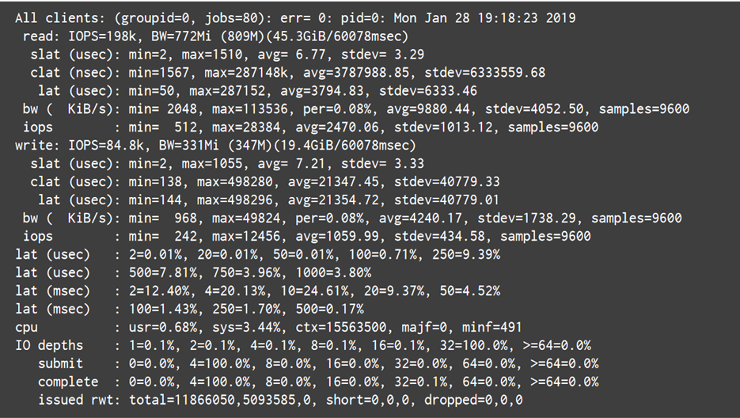

#__Проверка корректности настроек кластера и работоспособности серверного оборудования.__

Для это потребуется **fio** установленный на всех нодах, а также профили для него.

####Установка fio 
1) Для начала необходимо установить **fio** на всех нодах кластера:  

``` yaml
# yum install fio -y
```
####Создание дериктории 
<div style="text-align: justify" markdown>
2) Создаем директорию в “**Р-хранилище**”, которая будет использоваться для тестов (стандартный путь в профилях - **/mnt/vstorage/benchmark_dir**)
</div>

``` yaml
# mkdir /mnt/vstorage/benchmark_dir
# vstorage -c <наименование кластера> set-attr -R /mnt/vstorage/benchmark_dir replicas=2 tier=0
```
<div style="text-align: justify" markdown>
С помощью этой команды мы устанавливаем какой уровень хранилища и тип репликации данных нужно протестировать. **Tier** - задает уровень. Для указания репликации используется два варианта - **replicas** для реплики. **encoding** для кодирования. Есть следующие возможные варианты:
</div>

- **replicas=1**
- **replicas=2**
- **replicas=3**
- **encoding=1+0**
- **encoding=1+2**
- **encoding=3+2**
- **encoding=5+2**
- **encoding=7+2**
- **encoding=17+3**

Для проверки кодирования 3+2 на дисках 0 уровня, нужно будет запустить следующую команду:
``` yaml
# vstorage -c <наименование_кластера> -R /mnt/vstorage/benchmanr_dir encoding=3+2 tier=0
```
####Загрузка профилей
3)Скачиваем профили **fio**, и сохраняем их на ноде, с которой будет запущен тест **fio**. Ссылка на профили будет в конце письма.
####Запуск сервера fio
4)Запускаем **fio** сервер на всех нодах кластера

``` yaml
# fio --server
```
<div style="text-align: justify" markdown>
Будет запущен сервер **fio**, который будет использовать стандартный порт **8765**, поэтому так же необходимо открыть доступ к нему по сети, например с помощью **iptables**.
</div>

``` yaml
# iptables -I INPUT -p tcp -m tcp -m multiport --dports 8765 -j ACCEPT
```
####Редактирование профилей
<div style="text-align: justify" markdown>
5) Отредактировать все файлы профилей согласно указанным инструкциям внутри файлов.
**size** - должен быть равен двукратному размеру оперативной памяти на ноде.
**numjobs** - количество ядер процессора. В случае если включен **Hyper Threading**, то указываем количество потоков.
####Создание datasets
6) Создаем **dataset**'ы. Команду запускаем из папки, где находятся профили **fio**.
</div>

``` yaml
#for N in {<node1>,<node2>,<node3>,...,<nodeN>}; do fio --client=$N prepare-set.fio;done 
```
<div style="text-align: justify" markdown>
Выполнения команды может занять несколько минут. На этом подготовительный этап завершен. Для запуска теста необходимо запустить следующую команду:
</div>

``` yaml
# fio --client=<node1> seqread.fio --client=<node2> seqread.fio [...]
```
<div style="text-align: justify" markdown>
Количество клиентов равно количеству нод в кластере, вместо значения **nodeN** используем **IP** адрес ноды.
</div> 
<div class="annotate" markdown>

- **seqread.fio** - имя профиля. (1)
- **seqread.fio** - последовательное чтение.
- **randread.fio** - случайное чтение.
- **seqwrite.fio** - последовательная запись
- **randwrite.fio** - случайная запись
- **randrw.fio** - случайные чтение и запись
- **expand.fio** - последовательная запись в постоянно растущий файл, например, файлы резрвных копий, базы данных и т.д.
</div>

1. :person_raising_hand:{ .heart } вид теста

[Ссылка для скачивания профилей](https://disk.yandex.ru/d/YJLkBtLDVdd83g)
???+ success "Важно!"
    Если узлы кластера имеют кэши **SSD/NVMe**, убедитесь, что они очищены перед запуском любого профиля. Проверить кэши или журналы записи можно следующим образом:
    1. На узле кластера запустите
    ``` yaml
    # vstorage -c <наименование_кластера> top
    ```    
    2. Находясь на текстовой панели инструментов, нажмите на клавиатуре «**с**», чтобы развернуть вкладку блоков, а затем прокрутите столбцы с помощью клавиши «**i**».
    пока не увидите столбцы **JRN_FULL** и **s**.
    3. Подождите, пока **JRN_FULL** не станет равным **0%**, а каждый идентификатор **CS** будет помечен флагом c, например, «**JCc**». Это может занять некоторое время, когда кластер не находится под нагрузкой ввода-вывода.

<div style="text-align: justify" markdown>
По завершению теста **fio** отобразит результаты выполнения команды бенчмаркинга. Чем больше узлов участвует в тесте, тем больше результатов выдаст **fio**. Тем не менее, резюме будет предоставлено в конце, обозначенном слова «**All clients**». 
</div>
####Пример:
<figure markdown="span">
  { width="900" }
  <figcaption></figcaption>
</figure>
Это пример выходных данных задания **randrw.fio** (случайное чтение/запись), выполняемого на кластере **all-flash** из пяти узлов.
####Показатели
<div style="text-align: justify" markdown>
Основными метриками для случайного чтения/записи являются **IOPS** (операции чтения записи в секунду) и пропускная способность (**bw**):
</div>
<figure markdown="span">
  { width="900" }
  <figcaption></figcaption>
</figure>
<div style="text-align: justify" markdown>
Обратите внимание на **IOPS** при тестировании случайных рабочих нагрузок и наблюдайте за пропускной способностью при тестировании последовательных операций. При тестировании случайных операций чтения/записи также обратите внимание на параметр **iodepth**, который указывает сколько запросов поставлено в очередь и сколько ожидает.
</div>
Кроме того:
<div style="text-align: justify" markdown>

-	**slat** — это задержка отправки, которая указывает, сколько времени потребовалось для отправки ввода-вывода ядру.
-	**clat** — задержка завершения, показывающая, сколько времени прошло между отправкой в ядро и завершение ввода-вывода (исключая задержку отправки).
-	**lat** – это сумма **slat** и **clat**.
</div>
???+ success "Важно!"
    Результаты показаний особенно профиля последовательной записи приблизительно должны совпадать с суммой скорости записи всех дисков с ролью хранения или с ролью кэш минус расходы на реплику (задержка в сети хранилища) для одной ноды. Если результаты сильно разнятся необходимо проверять на корректность настроек кластера, а также корректность работы серверного оборудования. В случае если затрудняетесь проверить самостоятельно, то для такой проверки лучше обратится в поддержку Росплатформы **support@rosplatforma.ru**. 

####Параметры профилей
<div style="text-align: justify" markdown>
В следующих разделах перечислены профили, которые доступны для упрощения сравнительного анализа. Каждый профиль содержит ряд параметров (на примере **randread.fio**):
</div>
Сценарий **fio**. В данном случае случайные чтения:

``` yaml
rw=randread 
```
Размер набора данных. Должен быть как минимум в два раза больше оперативной памяти:

``` yaml
size=8g
```
Количество параллельных задач. Должно быть равно количеству ядер процессора:

``` yaml
numjobs=16 
```
Размер блока данных:

``` yaml
bs=4к
```
Асинхронная библиотека. Требуется параметр «**direct=1**»:

``` yaml
ioengine=libaio
```
Глубина очереди для асинхронных запросов:

``` yaml
iodepth=32
```
Ограничивает работу сценария **fio** по времени, а не по выполнению сценарий определенное количество раз. Сценарий будет выполнен столько раз, сколько успеет за определенный «**runtime**»:

``` yaml
time_based
```
Длительность сценария (по умолчанию в секундах):

``` yaml
runtime=60
```
Этот параметр заставляет данные записываться непосредственно на диск без кэширования и позволяет измерять фактическую производительность записи на диск:

``` yaml
direct=1
```
Формат имени файла. В данном случае это зависит от количества задач:

``` yaml
filename_format=__testfile’$jobnum’
```
Тип задачи. Если не установлено, вместо потоков будут создаваться процессы:

``` yaml
thread
```
Целевой каталог для набора данных:

``` yaml
directory=/mnt/vstorage/benchmark_dir
```
####Пример профиля
Ниже пример профайла, где необходимо вставить размер памяти в соответствии с конфигурацией оборудования:

``` yaml
[seqwrite]
rw=write
size=2x<RAM>/<CPU_cores>
numjobs=<CPU_cores>
bs=1m
ioengine=libaio
iodepth=32
time_based
runtime=60
direct=1
filename_format=__testfile'$jobnum'
thread
directory=/mnt/vstorage/benchmark_dir
```
Укажите требуемый размер и значения **numjobs** в каждом профиле задания узла:

- размер как минимум в два раза больше оперативной памяти узла, разделенного на количество ядер процессора узла,
- **numjobs** — количество ядер ЦП узла.
!!! success "Примечание:"
    Если **Hyper-Threading** включен, вместо этого используйте число потоков ЦП. Цель - полностью загрузить ЦП, но не под 100%. 


