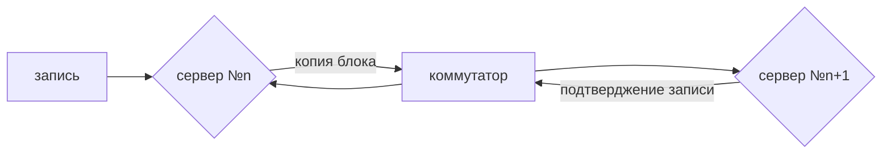

# __Подготовка конфигурации серверного оборудования по рекомендуемым требованиям ПО Росплатформы.__ 


  [:fontawesome-solid-file-pdf:](document.pdf){ .pdfb }


---
**Минимальная конфигурация для корректной работы кластера:**
---

В каждом сервере не менее двух физических портов от 10Гбит для сети компонента Р-хранилище (данная сеть является внутренней сетью только для блочного уровня (**SDS**)). Отдельно на каждом сервере не менее двух физических портов от 1Гбит для сети компонента Р-управление (Сеть может быть связана с публичной и использована для виртуализации или доступа к **s3**).

???+ success "Важно!"
    Необходимо не менее 3 стоечных сервера архитектуры x86. 

Для работоспособности всех сервисов платформы на каждом сервере не менее 64ГБ памяти и от 1-ого процессора с 8-ю или 10-ю физическими ядрами с частотой не менее 2Гигагерца. 

Для установки операционной системы Росплатформы физический диск не менее 64ГБ объема. Опционально рекомендуется устанавливать на физический том состоящий из двух физических дисков с **RAID1** за счет аппаратного **RAID** контроллера на борту сервера для защиты операционной системы Росплатформы от сбоя одного из системных дисков (кэш контроллера желательно выключить).

**RAID1** для системных дисков настраивается заранее перед началом установки Росплатформы за счет настроек биоса сервера или **firmware**, а для дисков под кластер Р-хранилища отключается.

Диски под систему могут быть как **HDD** так и **SSD** с не менее **DWPD1**. Предпочтительнее устанавливать под систему **SSD** так как в этом случае на системных дисках можно разместить службу метаданных от Р-хранилища, которая не требует большого дискового пространства(3ГБ свободного дискового пространства на 100ТБ данных в кластере). 

Для организации блочного хранилища (**SDS**-Р-хранилища) с возможностью включения кластера необходимо не менее трех дисков на каждом сервере, желательно не менее гибридного массива, состоящего из одного **SSD** и двух **HDD**, где первый это **SSD** корпоративного уровня с **DWPD** не менее 3, с объемом не менее 100ГБ. Максимальный показатель последовательной скорости записи этого диска должен быть не меньше суммы скорости медленных дисков **HDD**. Два диска **HDD** должны быть так же не менее 100ГБ объемом. Все диски для хранилища должны быть презентованы по **JBOD** через **HBA** или на прямую через **JBOD** от интерфейса материнской платы или **RAID** контроллера, поддерживающего одновременную презентацию дисков для хранилища по **JBOD** и **RAID1** для системного диска. 

Если не имеется возможность установить, как минимум гибридный набор дисков, то в этом случае можно использовать только **HDD** также презентованные по **JBOD**, но в этом случае скорость ввода вывода будет ниже, чем у гибридного или у массива, который будет состоять только из **SSD**. 

В случае, когда все диски **SSD**, они должны быть не менее **DWPD 1** и в этом случае не требуется назначать роль КЭШ, все диски будут с ролью хранения, а на системном будет совместно использоваться роль метаданных.

Коммутация кластера из 3 или более серверов обеспечивается за счет не менее двух ethernet коммутаторов c поддержкой **MLAG** или **VPC**. На стороне серверов настраивается **LACP** в режиме:

``` yaml 
  xmit-hash-policy=layer3+4 
```

а также **MTU9000** для интерфейсов от 10Гбит и более. На стороне коммутаторов также необходима поддержка **jumbo frame**.

В случае больше количества дисков чем два для каждой ноды, где сумма скорости дисков превышает пропускную способность сети Р-хранилища желательно использовать 25Гбит или более вместо 10Гбит в агрегации для задействования всех скоростных возможностей дисков, так как синхронная репликация с подтверждением записи выполняется по сети Р-хранилища.

Сеть хранилища должна быть в режиме доступа(**access**) **L2**, то есть не в режиме **Trunk**. Адресация статическая без указания шлюза. Сеть для компонента Р-управления может быть в Trunk для разделения трафика управления от сети доступа и от сети виртуализации или **S3**, где каждый трафик в своем теге (**VLAN**).

Адресация в сети Р-управления также статическая, для доступа из других сетей или подключения интернета можно прописывать шлюз и **DNS** сервер. Статические адреса могут быть настроены через **DHCP** сервер для исключения появления большего количества шлюзов, прописываемых на сервере. Наличие нескольких шлюзов, прописанных непосредственно в настройках каждого сервера, не поддерживается и требует специальных настроек маршрутов, что усложняет сетевые настройки и сам процесс развертывания такой конфигурации.   


???+ success "Важно!"

    В случае использования **S3**, для балансировки нагрузки по сети доступа к **S3** между серверами или шлюзами **S3** используется внешние программные или аппаратные балансировщики.  

---
**Пример коммутации кластера Росплатформа:**
---

<figure markdown="span">
  { width="500" }
  <figcaption></figcaption>
</figure> 
<figure markdown="span">
  { width="900" }
  <figcaption></figcaption>
</figure> 

---
**Пример минимальной конфигурации для кластера:**
---

**3 сервера:**

*	1 CPU 2Ггц 8-10 ядер
*	RAM 64 GB+
*	SAS/SATA HBA-адаптер с поддержкой режима JBOD
*	для загрузки гипервизора/ОС - как минимум 1 диск с объемом не менее 100ГБ или два диска в RAID1 средствами аппаратного RAID-контроллера
*	1 x SSD + 2 x HDD (гибридный массив) JBOD 
*	2 x 10 Gbit Ethernet (отдельная сеть для хранилища данных)
*	2 x 1Gbit Ethernet (для сети управления и s3 доступа)
*	два коммутатора Ethernet 1/10 Гбит портов в агрегации LACP с поддержкой MLAG или VPC.

---	
**Пример конфигураций с большим количеством дисков или массивом другого типа для увеличения производительности:**
---

**5 серверов:**

*	2 x CPU 2Ггц 8-10 ядер 
*	RAM 128 GB
*	SAS/SATA HBA-адаптер с поддержкой режима JBOD
*	для загрузки гипервизора/ОС - как минимум 1 диск с объемом не менее 100ГБ или два диска в RAID1 средствами аппаратного RAID-контроллера
*	2 x SSD (all flash), минимум 2 шт или более (самый быстрый массив, где роль кэш как в гибриде не используется). Все SSD диски с DWPD не менее 1.
*	2 x 10 Gbit Ethernet или 2 x 25 и более (отдельная сеть для хранилища данных)
*	2 x 10 Gbit Ethernet (для сети управления и виртуализации)

---
**Пропорциональность для расчета гибридного массива:**
---

На один SSD с ролю кэш подключается 3 или 4 HDD с ролью хранения. Если SSD больше одного, то на каждый по 3 или 4 HDD.  Количество HDD зависит от максимальной последовательной скорости записи SSD, то есть она не должна быть меньше, чем сумма скорости последовательной записи всех HDD, которые будут подключены к этому SSD. Например: если один SSD имеет максимальную скорость записи, заявленную производителем 1000МБ/c, а диски HDD c RPM 10K в среднем показывают 250МБ/c, то 1000/250=4(диска HDD).

Для массива all-flash роль кэш не используется, и все диски идут с ролью хранения, 
При этом все диски должны быть с одинаковыми скоростными показателями и объемом. 

**Пропорциональность расчета пропускной способности сети для внутреннего блочного взаимодействия хранилища следующая:**

Сумма скорости всех SSD дисков одного сервера должна соответствовать возможности пропускного канала сети хранения блочного уровня. Например, если один диск SSD имеет скорость последовательной записи, заявленной производителем 1000МБ/c то умножив на 8 бит мы получим 8Гбит необходимый пропускной канал для этого диска. Соответственно если на борту одного сервера 10 таких дисков, то пропускной канал сети блочного уровня должен быть не менее 80Гбит. В случае использования только 2x10Гбит, то максимальная скорость записи для одной реплики будет 2250МБ/c (18Гбит) деленная на количество узлов, которые одновременно записывают.



---
**Расчет ресурсов памяти и процессора:**
---
**CPU:**

*	Не менее 8-10 физических ядер на сервер. 
*	Для операционной системы Росплатформы необходимо не менее 4 ядер.
*	Управление 0.5-1 ядро.
*	Для службы метаданных блочного уровня одно ядро (одна служба на один сервер).
*	Для сервисов блочного хранения на одно ядро 8 дисков.
*	Для сервиса клиента блочного уровня (точка монтирования для протокола FASTPATH (TCP/IP), одна точка на один сервер) 1 ядро.
*	Для сервисов S3 1.7 ядро.

**RAM:**

*	Не менее 64ГБ памяти на сервер.
*	Для операционной системы Росплатформы не менее 4-5ГБ. 
*	Управление 2-4ГБ. 
*	Для службы метаданных блочного уровня - 1ГБ на 100ТБ данных. 
*	Для сервисов блочного хранения - 1ГБ на каждую службу (диск).
*	Для сервиса клиента блочного уровня - 1ГБ.
*	Для сервисов S3 - 8ГБ.

???+ success "Важно!"
    Ресурсы необходимые для виртуальных сред добавляются в конфигурацию поверх вышеописанных.

---
**Расчет объема полезного хранения и количества узлов:**
---

Р-Хранилище поддерживает ряд режимов для каждого метода избыточности. В 
таблице ниже представлены издержки данных для разных режимов избыточности. 
Первые три строки относятся к репликации, остальные – к избыточному кодированию.

|Режим избыточности|Минимальное число необходиммых серверов|Допустимное число отказавших серверов|Издержки хранилища,%|Неразмеченое пространство,требуемое для хранения 100ГБ данных|
| - | - | - | - | - |
|1 реплика без избыточности|1|0|0|100ГБ
|2 реплики|2|1|100|200ГБ
|3 реплики|3|2|200|300ГБ
|дирование 1+0 (без избыточности)|1|0|0|100ГБ
|Кодирование 1+2|3|2|200|300ГБ
|Кодирование 3+2|5|2|67|167ГБ
|Кодирование 5+2|7|2|40|140ГБ
|Кодирование 7+2|9|2|29|129ГБ
|Кодирование 17+3|20|3|18|118ГБ

!!! success "Примечание:"
    Режимы избыточного кодирования 1+0 и 1+2 предназначены для небольших кластеров с недостаточным числом серверов для использования других режимов избыточного кодирования, но которые планируется расширить в будущем. Так как после выбора типа избыточности его невозможно поменять (с репликации на избыточное кодирование, или наоборот), данный режим позволяет выбрать избыточное кодирование, даже если кластер не соответствует рекомендациям. После расширения кластера можно выбрать более полезный режим избыточности.

Кроме выше приведенной таблицы необходимо учитывать Кворум на базе алгоритма **Paxos**, где должно оставаться большинство нод в случае выхода из строя. Например, при минимальной конфигурации из трех или четырех серверов может выйти из строя только один сервер, независимо от того, что настроена реплика 2 или реплика 3. При конфигурации из 5 серверов и реплики 3 может из строя выйти только два сервера. Кворум контролируется на уровне служб метаданных поэтому на каждом сервере по одной такой службе. При большом количестве серверов (больше чем 5) на последующих серверах можно не делать службу метаданных или делать по одной службе на одном из серверов из группы. 

Для применения кодирования используются быстрые массивы, начиная от гибридного, где на один **SSD** подключается 3-4 **HDD**, быстрые **all-flash**, где все диски **SSD**, или возможно использование гибридного **all-flash**, где **NVMe** или **intel Optane** в три или четыре раза быстрее обычного **SSD**, В этом случае на один **NVMe** в роли кэша на 3-4 **SSD**. 

???+ success "Важно!"
    Количество дисков на сервер в среднем считается 20 дисков на узел. Большее число узлов с меньшем количеством дисков предпочтительнее, чем большее количество дисков на один сервер в кластере с минимальным числом серверов. Конфигурация из 5 или 10 серверов, где каждый сервер по 20 дисков будет лучше, чем всего 5 серверов, где каждый сервер по 60 дисков. 


